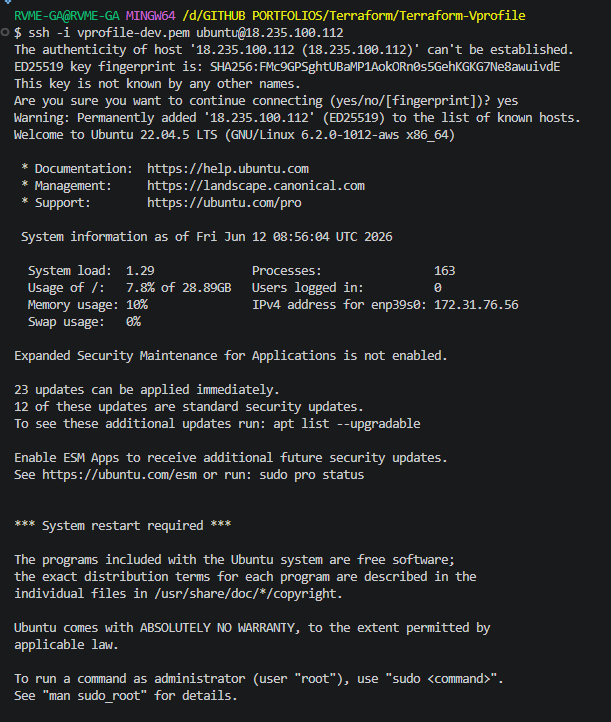
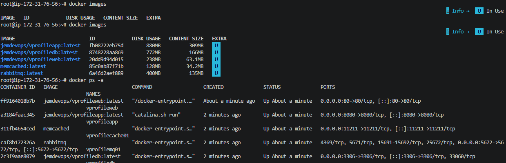
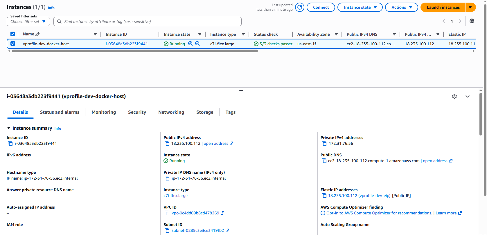
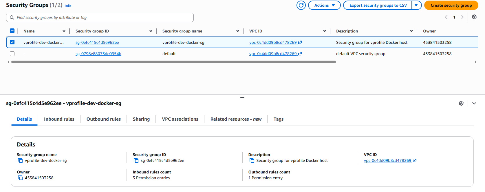
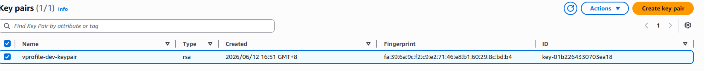
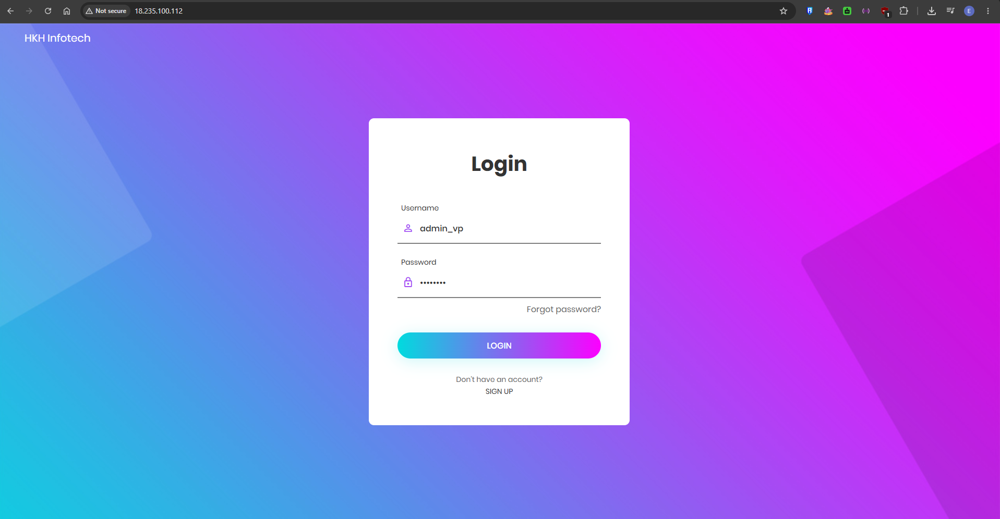
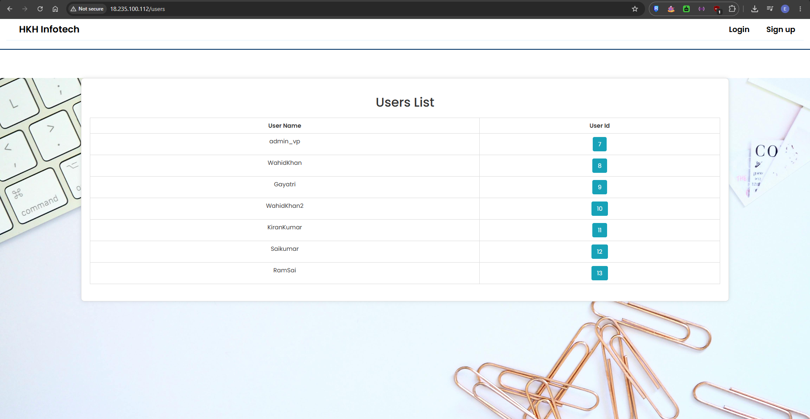
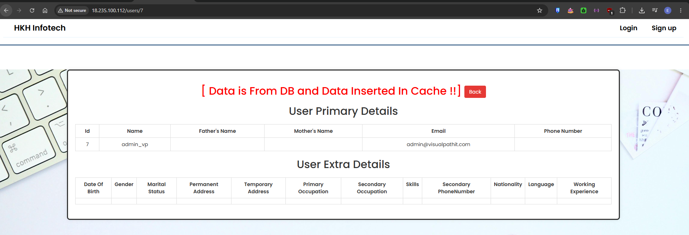
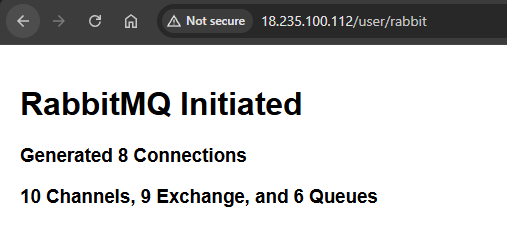

# vprofile — AWS Terraform + Docker Deployment Guide

A step-by-step guide to provision an AWS EC2 instance and run the full
vprofile stack (MySQL · Memcached · RabbitMQ · Tomcat · Nginx) using
Terraform and Docker Compose.

---

## Table of Contents

1. [Prerequisites](#1-prerequisites)
2. [Create a Terraform Admin IAM User](#2-create-a-terraform-admin-iam-user)
3. [Configure AWS CLI](#3-configure-aws-cli)
4. [Generate an SSH Key Pair](#4-generate-an-ssh-key-pair)
5. [Clone / Set Up the Project](#5-clone--set-up-the-project)
6. [Configure terraform.tfvars](#6-configure-terraformtfvars)
7. [Deploy with Terraform](#7-deploy-with-terraform)
8. [Verify the Stack](#8-verify-the-stack)
9. [Proof — Deployment Screenshots](#9-proof--deployment-screenshots)
10. [Useful Commands on the Instance](#10-useful-commands-on-the-instance)
11. [Tear Down](#11-tear-down)
12. [File Reference](#12-file-reference)
13. [Instance Sizing Notes](#13-instance-sizing-notes)

---

## 1. Prerequisites

Install the following tools before starting:

| Tool | Version | Install |
|---|---|---|
| Terraform | ≥ 1.6 | https://developer.hashicorp.com/terraform/install |
| AWS CLI | v2 | https://docs.aws.amazon.com/cli/latest/userguide/install-cliv2.html |
| Git | any | https://git-scm.com/downloads |

Verify installations:

```bash
terraform -version
aws --version
git --version
```

---

## 2. Create a Terraform Admin IAM User

Terraform needs an IAM user with programmatic access to provision resources.
**Never use your AWS root account.**

### Step-by-step in the AWS Console

1. Open the [IAM Console](https://console.aws.amazon.com/iam) → **Users** → **Create user**

2. Set the username:
   ```
   terraform-admin
   ```

3. On the **Set permissions** step, choose **Attach policies directly** and attach:
   ```
   AdministratorAccess
   ```
   > For tighter security in production, create a custom policy limited to
   > EC2, VPC, and IAM key-pair actions instead of `AdministratorAccess`.

4. Complete the wizard and click **Create user**

5. Open the new user → **Security credentials** tab → **Create access key**

6. Choose use case: **Command Line Interface (CLI)**

7. Copy and save both values — you will only see the secret once:
   ```
   Access key ID:     AKIAxxxxxxxxxxxxxxxx
   Secret access key: xxxxxxxxxxxxxxxxxxxxxxxxxxxxxxxxxxxxxxxx
   ```

---

## 3. Configure AWS CLI

Feed the credentials you just created into the AWS CLI:

```bash
aws configure
```

Fill in each prompt:

```
AWS Access Key ID [None]:     AKIAxxxxxxxxxxxxxxxx
AWS Secret Access Key [None]: xxxxxxxxxxxxxxxxxxxxxxxxxxxxxxxxxxxxxxxx
Default region name [None]:   us-east-1
Default output format [None]: json
```

Confirm the CLI is working:

```bash
aws sts get-caller-identity
```

Expected output (your account ID will differ):

```json
{
    "UserId": "AIDAXXXXXXXXXXXXXXXXX",
    "Account": "123456789012",
    "Arn": "arn:aws:iam::123456789012:user/terraform-admin"
}
```

---

## 4. SSH Key — Auto-Generated by Terraform

No manual `ssh-keygen` needed. The `keypair.tf` uses the `tls_private_key`
resource to generate a 4096-bit RSA key automatically during `terraform apply`.

- The **public key** is uploaded to AWS as an EC2 Key Pair
- The **private key** is saved as `vprofile-dev.pem` in your project folder

> **Important:** Add `*.pem` to your `.gitignore` — never commit private keys to a repo.

---

## 5. Clone / Set Up the Project

```bash
git clone https://github.com/jemarzan/vprofile-aws-terraform-docker.git
cd Vprofile-Docker-Terraform
```

Directory structure:

```
vprofile-terraform/
├── provider.tf
├── variables.tf
├── terraform.tfvars.example
├── keypair.tf
├── security_group.tf
├── instance.tf
├── insID.tf
├── screenshots/
│   ├── 0_ssh_login.PNG
│   ├── 1_docker_images.PNG
│   ├── 2_instance.PNG
│   ├── 3_SG.PNG
│   ├── 5_LOGIN.PNG
│   ├── 6_mysql.PNG
│   └── 7_memcache.PNG
└── README.md
```

---

## 6. Configure terraform.tfvars

Copy the example file and edit it:

```bash
cp terraform.tfvars.example terraform.tfvars
```

Open `terraform.tfvars` in your editor and update the values:

```hcl
aws_region   = "us-east-1"
environment  = "dev"
project_name = "vprofile"

instance_type = "c7i-flex.large"

# Ubuntu 22.04 LTS AMI — look up the correct ID for your region:
# aws ec2 describe-images --owners 099720109477 \
#   --filters "Name=name,Values=ubuntu/images/hvm-ssd/ubuntu-jammy-22.04-amd64-server-*" \
#             "Name=state,Values=available" \
#   --query "sort_by(Images,&CreationDate)[-1].ImageId" --output text
ami_id = "ami-0fc5d935ebf8bc3bc"

# Restrict SSH to your own IP for security — find yours: curl ifconfig.me
allowed_ssh_cidr = "YOUR_IP/32"
allowed_web_cidr = "0.0.0.0/0"

vpc_id    = ""
subnet_id = ""

root_volume_size = 30
```

---

## 7. Deploy with Terraform

```bash
# Step 1 — Download providers and initialise (use -upgrade if you added new providers)
terraform init -upgrade

# Step 2 — Preview what will be created
terraform plan

# Step 3 — Create the resources
terraform apply
```

Type `yes` when prompted. After a successful apply you will see:

```
Apply complete! Resources: 5 added, 0 changed, 0 destroyed.

Outputs:
  instance_id        = "i-03648a3db223f9441"
  instance_public_ip = "your_public_ip"
  pem_file_path      = "./vprofile-dev.pem"
  ssh_command        = "ssh -i vprofile-dev.pem ubuntu@your_public_ip"
  vprofile_url       = "http://your_public_ip"
  vproapp_direct_url = "http://your_public_ip:8080"
```

The instance then runs a **user-data bootstrap script** that:
1. Updates the OS packages
2. Installs Docker Engine + Docker Compose plugin (official repo)
3. Writes `/opt/vprofile/docker-compose.yml`
4. Pulls all 5 images and starts the stack
5. Registers a systemd service so the stack restarts on reboot

This takes **3–5 minutes** after Terraform finishes.

---

## 8. Verify the Stack

### Watch the bootstrap log live

```bash
ssh -i vprofile-dev.pem ubuntu@<instance_public_ip> \
    "tail -f /var/log/vprofile-init.log"
```

Wait until you see:
```
=== vprofile bootstrap complete ===
```

### Check all containers are running

```bash
ssh -i vprofile-dev.pem ubuntu@<instance_public_ip> \
    "cd /opt/vprofile && docker compose ps"
```

All 5 services should show `running`:

```
NAME              IMAGE                           STATUS
vprofiledb        jemdevops/vprofiledb:latest     running
vprofilecache01   memcached                       running
vprofilemq01      rabbitmq                        running
vprofileapp       jemdevops/vprofileapp:latest    running
vprofileweb       jemdevops/vprofileweb:latest    running
```

### Access the app

| URL | Service |
|---|---|
| `http://<public_ip>` | vprofile web app (via Nginx) |
| `http://<public_ip>:8080` | Tomcat direct (dev only) |

Default login credentials:
```
Username: admin_vp
Password: admin_vp
```

---

## 9. Proof — Deployment Screenshots

### SSH Login to EC2 Instance
Successfully connected to the EC2 instance (`your_public_ip`) using the
auto-generated `vprofile-dev.pem` key on Ubuntu 22.04.5 LTS.



---

### Docker Images Pulled & All Containers Running
All 5 vprofile images are present and every container shows `Up` status —
`vprofileweb` on port 80, `vprofileapp` on 8080, `memcached` on 11211,
`rabbitmq` on 5672, and `vprofiledb` on 3306.



---

### EC2 Instance in AWS Console
Instance `i-03648a3db223f9441` named `vprofile-dev-docker-host` running as
`c7i-flex.large` in `us-east-1f` with Elastic IP `your_public_ip` attached.



---

### Security Group in AWS Console
Security group `vprofile-dev-docker-sg` created with 3 inbound rules (SSH,
HTTP, Tomcat) and 1 outbound rule (all traffic).



---

### Key Pair in AWS Console
EC2 Key Pair `vprofile-dev-keypair` auto-generated by Terraform using `tls_private_key`
— RSA type, created on 2026/06/12. The matching `vprofile-dev.pem` private key is saved
locally in the project folder.



---

### Application Login Page
vprofile login page served via Nginx on port 80 — logging in as `admin_vp`.



---

### MySQL (DB) Verification — Users List from Database
After login, navigating to `/users` shows the users list pulled directly
from the MySQL database container (`vprofiledb`).



---

### Memcache Verification — Data Inserted in Cache
Clicking a user profile shows **"Data is From DB and Data Inserted In Cache !!"**
confirming that Memcached (`vprocache01`) is working correctly.



---

### RabbitMQ Verification — Connections & Queues Active
Navigating to `/user/rabbit` confirms RabbitMQ (`vpromq01`) is fully operational —
8 connections, 10 channels, 9 exchanges, and 6 queues initiated.



---

## 10. Useful Commands on the Instance

SSH in first:
```bash
ssh -i vprofile-dev.pem ubuntu@<instance_public_ip>
cd /opt/vprofile
```

```bash
# View running containers and their ports
docker compose ps

# Stream logs from all containers
docker compose logs -f

# Stream logs from a specific service
docker compose logs -f vproapp

# Restart a single service
docker compose restart vproapp

# Pull the latest images and recreate containers
docker compose pull && docker compose up -d

# Stop the entire stack (volumes kept)
docker compose down

# Stop and delete volumes too (destroys DB data)
docker compose down -v

# Check Docker disk usage
docker system df
```

---

## 11. Tear Down

To delete **all** AWS resources created by Terraform:

```bash
terraform destroy
```

Type `yes` when prompted.

> What gets deleted: EC2 instance, Elastic IP, Security Group, Key Pair.
> The EBS root volume is also deleted (`delete_on_termination = true`).

---

## 12. File Reference

| File | Purpose |
|---|---|
| `provider.tf` | AWS + TLS + Local provider version locks and default tags |
| `variables.tf` | All input variables and their defaults |
| `terraform.tfvars.example` | Template — copy to `terraform.tfvars` and fill in |
| `keypair.tf` | Auto-generates RSA key pair; saves `.pem` locally, uploads public key to AWS |
| `security_group.tf` | Firewall rules: SSH (22), HTTP (80), Tomcat (8080) |
| `instance.tf` | c7i-flex.large EC2 + Elastic IP + Docker bootstrap user-data |
| `insID.tf` | Outputs: instance ID, IPs, pem path, SSH command, app URLs |

---

## 13. Instance Sizing Notes

| Instance type | vCPU | RAM | Suitable for |
|---|---|---|---|
| `c7i-flex.large` | 2 (burstable) | 4 GB | Dev / demo — default |
| `c7i.large` | 2 (fixed) | 4 GB | Light staging / sustained load |
| `c7i.xlarge` | 4 | 8 GB | Staging / production |
| `c7i.2xlarge` | 8 | 16 GB | Production with headroom |

Change the type any time by updating `instance_type` in `terraform.tfvars`
and running `terraform apply`.

---

## Troubleshooting

**Cannot SSH into the instance**
Check that `allowed_ssh_cidr` matches your current public IP (`curl ifconfig.me`),
then run `terraform apply` to update the security group rule.

**App not reachable on port 80 after 5 minutes**
SSH in and check: `cat /var/log/vprofile-init.log`. Also run
`docker compose ps` — if containers show `Exit`, check `docker compose logs <service>`.

**Wrong AMI for your region**
Run the `aws ec2 describe-images` command in §6 with your target region,
then update `ami_id` in `terraform.tfvars`.

**`c7i-flex` not available in my region / AZ**
Change `instance_type` to `t3.large` or `m5.large` as a universal fallback,
or update the AZ filter in `security_group.tf` to match your region's supported zones.

**Lock file out of sync after adding providers**
Run `terraform init -upgrade` to refresh `.terraform.lock.hcl`.

---

## AI Assistance Disclaimer

> This project was built with the assistance of **Claude (Anthropic AI)**.
>
> AI was used to help generate and debug the Terraform configuration files,
> write the user-data bootstrap script, and produce this documentation.
> All infrastructure was personally deployed, tested, and verified by the author
> as demonstrated in the screenshots above.
>
> The use of AI-assisted tooling reflects modern DevOps and engineering workflows
> where AI serves as a productivity accelerator — not a replacement for
> hands-on understanding and validation.
